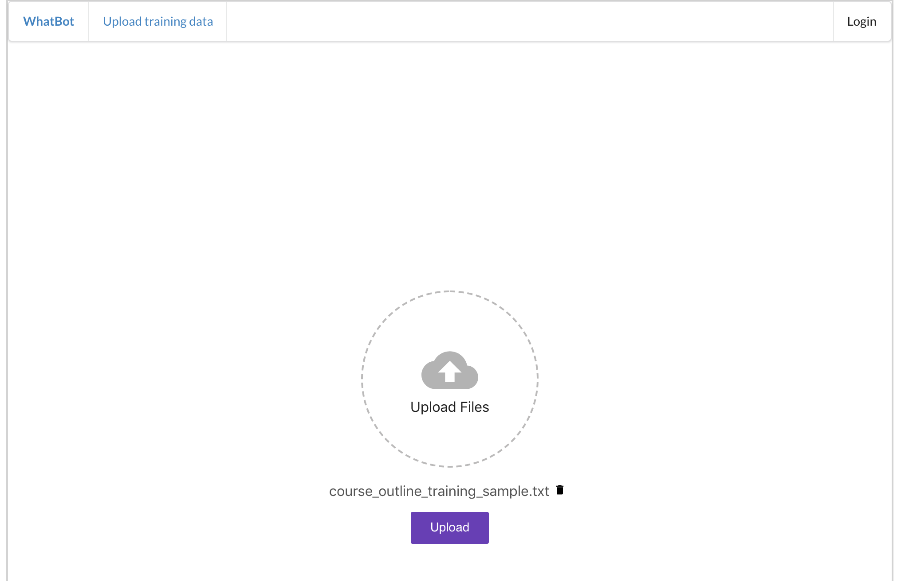
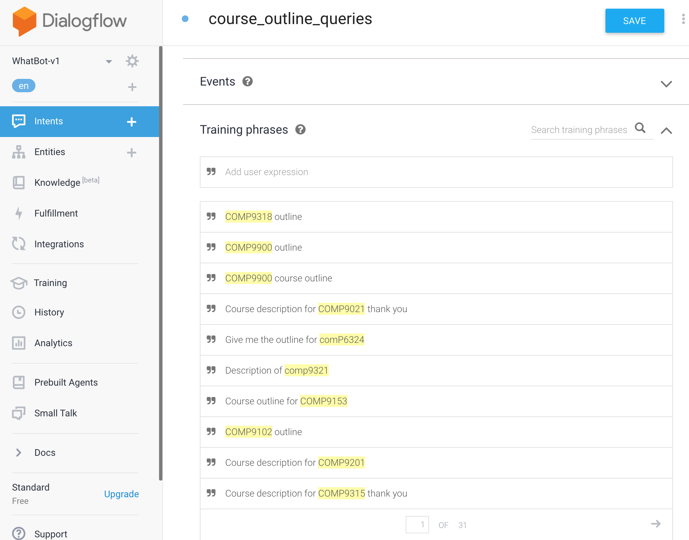

# Management Module
Management module is essentially the backstage of the chatbot system, where course staff member can tune the chatbot and update the AI model in Dialogflow. It is mainly responsible for the automation training feature and utilizes AWS S3's file storage to operate.  

## Features

### Automatic AI model training

#### What is it?
This feature allows admin users or engineers to update WhatBot's NLP models without the need of manually going into Dialogflow console to create a new intent or entity. It leverages Dialogflow APIs so that users can simply upload a training data configuration file, which follows the configuration described in [how to use query trainer](https://github.com/comp3300-comp9900-term-1-2019/capstone-project-whatbot/tree/master/backend/query_module#how-to-train), through the "Upload training data" tab in WhatBot's UI and the intent or entity will be trained in Dialogflow. This automation process makes WhatBot unique as it means developers or administrators can quickly react and adapt WhatBot to new type of queries as long as the data required to answer those queries is available in the database. Furthermore, it also generate significant more amount of training queries with only a few training data and this remove the manual process of having user to enter variations of training queries by themselves on Dialogflow console.
In summary, automatic AI model training provides these advantages:
- Rapid Dialogflow NLP model update making it easily adaptable to new use cases by creating or updating intents and entities.  
- Generate training queries. For example, given 10 training data, it can produce more than 200 training queries to be used to make the NLP model more robust.  
- Useable through web interface or command line, making it user friendly for even user without any computer knowledge.  

#### How is it different from Dialogflow console?
Dialogflow also provide a feature for user to upload conversation logs into it's console [See here](https://dialogflow.com/docs/training-analytics/training). However, WhatBot's automatic AI training feature is a lot more powerful and this will be described in this section.

##### 1. Dialogflow console's upload file cannot create a new intent directly

While conversation logs can be uploaded onto Dialogflow console, it cannot be used to create a new intent. Dialogflow will only try to match the lines in conversation logs to an existing intent and add the lines as training queries into those existing intent. Therefore, you cannot create a new intent using console's feature without having to manually create that intent yourself and enter some training queries for the lines in the conversation logs to be matched to it. If you do not do so, you have to manually label each line in the conversation log you uploaded to an intent yourself.  
However, with WhatBot's automatic AI training feature, user's can create brand new intent or update an existing one by simply specifying the intent name along with some training queries.  
For example:  
Scenario: User is trying to create an intent for course outline.  
**User using Dialogflow console**  
Step 1.  
User prepares the conversation log which looks like a .txt file with the following content:
```
I want to get the course outline for COMP9900
Show me the course outline for COMP9900
Course outline for COMP9318
COMP9415's course outline
Outline for COMP9331
```
Step 2.
On Dialogflow console, user navigates to the "Training" tab and click "Upload".  


Step 3.
After upload, they see the 5 requests because we entered 5 lines above and we also see 5 no match because the intent for `course outline related queries` did not exist before.  


Step 4. 
User is then required to go into it and manually create the new intent themselves and also label the entities as well. 
  
_User creating a new intent themselves by clicking create new._  
  
_User doing manual entity labelling as Dialogflow console often does not pick up custom entities._  

**User using WhatBot's automatic AI training feature**  
Step 1. 
User prepares the training data file where they can specify the intent's attributes like: `display_name`, `message_texts`, `parent_followup`, `input_context`, `reset_contexts`, `output_context`. More detail on training data file configuration click [here](https://github.com/comp3300-comp9900-term-1-2019/capstone-project-whatbot/tree/master/backend/query_module#how-to-train). In this example, we will use the an example configuraton file which is also for the the scenario above:
```
display_name course_outline_queries
message_texts $course
intent_types course_outline
reset_contexts
What is {course code} about?
Tell me more about {course code}
What can I learn in {course code}
Description of {course code}
Course outline for {course code}
Give me the course outline of {course code}
Give me a description of {course code}
I want to know what {course code} is about
Describe {course code} for me
I want to see the course outline for {course code}
Show me the course outline for {course code}
I want the outline for {course code}
Give me the outline for {course code}
{course code} outline
{course code} course outline
Course description for {course code} please
Course description for {course code}
Course description for {course code} thanks
Course description for {course code} thank you
I want to see the course outline for {course code}
I want to see the course description for {course code}
outline for {course code}
Course outline {course code}
I want to know about {course code}
I want to find out more about {course code}
Tell me about {course code}
{course code} description
```

Step 2.  
User uploads the file through web interface. 
 

Step 3.  
User can see that the intent has being created on Dialogflow console with more than 300 training phrases that was generated by WhatBot's training query generation feature. User can also see that entities has being labelled through WhatBot's backend doing the query analysis. 
 

##### 2. Dialogflow console's upload file cannot label custom entites accurately
Using the example used above, we can also see that Dialogflow console's upload file feature cannot label custom entites accurately very often while WhatBot's automatic AI training features leverages it's entity training feature and having user provide where these entities should be to accurately label them using Dialogflow APIs for training.  

##### 3. Dialogflow console's upload file cannot be used for creating new entities or updating existing entities
The upload file for training feature in Dialogflow cannot be used for training entities while WhatBot's automatic AI training feature can be by following the entity training file configuration menthioned in [here](https://github.com/comp3300-comp9900-term-1-2019/capstone-project-whatbot/tree/master/backend/query_module#entities). This is also the feature that allow accurate entity labelling mentioned in the last difference.  

##### 4. Dialogflow console's upload file cannot be used to configure an intent, e.g. followup, response and contexts
From the usage example above, you can see that parameters such as `message_texts` and `reset_contexts` were specified in WhatBot's configuration file as a requirement. This allowed WhatBot users to setup various parameters for the intent right away upon creation. Parameters like `message_texts` is used to specify how the intent should respond and `reset_contexts` is used to specify whether this intent will mark the end of a conversation. WhatBot also offer context and followups to be configured as well by specifying fields such as `parent_followup`, `input_context`, `output_context` and `action`. For more detail on the training data configuration see [here](https://github.com/comp3300-comp9900-term-1-2019/capstone-project-whatbot/tree/master/backend/query_module#how-to-train). All of these, cannot be done on Dialogflow automatically.  

### Data Analytics

#### Intent Usage
Provides data on the amount of usage for each intent and return the result to the user. Therefore, user who calls this can get a better idea of how their system is being used and what the consumer cares most about.   

#### Intent Timeline
Provides a timeline data (based on last 7 day) on how much each intent has been used. From this, user can see what is the current trend of their consumer and be able to react to more people's questions faster.  

#### Intent Confidence
Provides the average confidence level that Dialogflow has for the botton n intent. This lets the user knows how well the system is performing so that they can use the automation training feature to improve the system if required.  

#### 3D Timeline Intent Usage
Provides a 3D view of top n intent's accumulative usage in the last 7 days so user can get a better understanding of user behaviour.