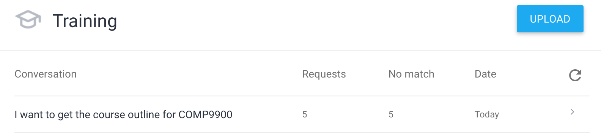
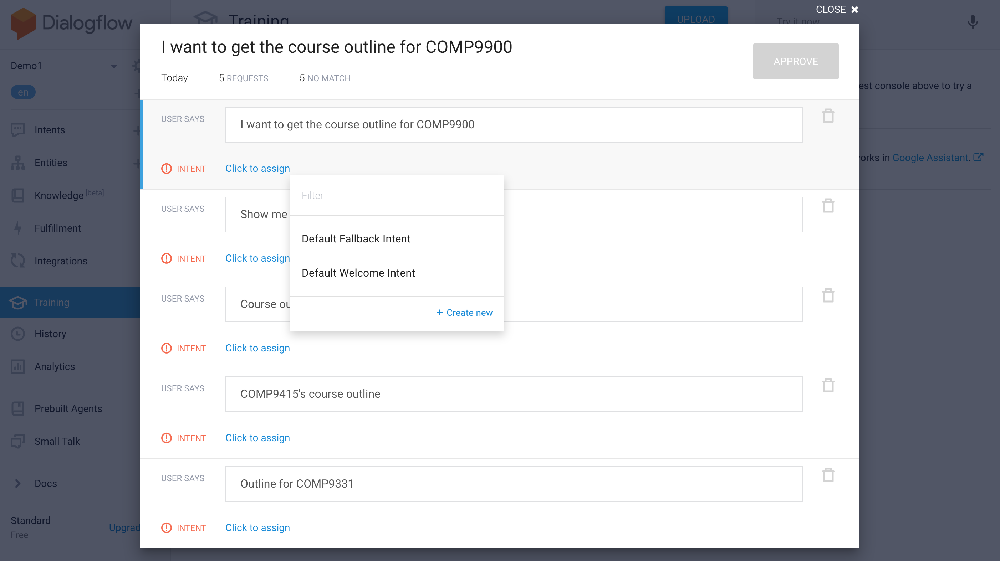
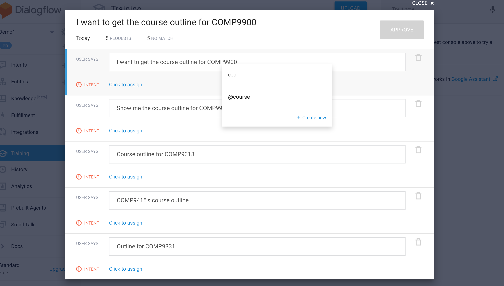

# Management Module
Management module is essentially the backstage of the chatbot system, where course staff member can tune the chatbot and update the AI model in Dialogflow. It is mainly responsible for the automation training feature and utilizes AWS S3's file storage to operate.  

## Features
### Automatic AI model training
#### What is it?
This feature allows admin users or engineers to update WhatBot's NLP models without the need of manually going into Dialogflow console to create a new intent or entity. It leverages Dialogflow APIs so that users can simply upload a training data configuration file, which follows the configuration described in [how to use query trainer](https://github.com/comp3300-comp9900-term-1-2019/capstone-project-whatbot/tree/master/backend/query_module#how-to-train), through the "Upload training data" tab in WhatBot's UI and the intent or entity will be trained in Dialogflow. This automation process makes WhatBot unique as it means developers or administrators can quickly react and adapt WhatBot to new type of queries as long as the data required to answer those queries is available in the database. Therefore, you can imagine how powerful and flexible WhatBot can become as it can be updated for new usage cases very quickly. Furthermore, it also generate significant more amount of training queries with only a few training data and this remove the manual process of having user to enter variations of training queries by themselves on Dialogflow console. AI model training can also be triggered through command line for developers allowing it to be used without going through the web interface making the system super usable by all users with access to it.  
In summary, automatic AI model training provides these advantages:
- Rapid Dialogflow NLP model update making it easily adaptable to new use cases.  
- Generate training queries. For example, given 10 training data, it can produce more than 200 training queries to be used to make the NLP model more robust.  
- Useable through web interface or command line, making it user friendly for even user without any computer knowledge.  

#### How is it different from Dialogflow console?
Dialogflow also provide a feature for user to upload conversation logs into it's console [See here](https://dialogflow.com/docs/training-analytics/training). However, WhatBot's automatic AI training feature is a lot more powerful and this will be described in this section.
##### 1. Dialogflow console's upload file cannot create a new intent directly
While conversation logs can be uploaded onto Dialogflow console, it cannot be used to create a new intent. Dialogflow will only try to match the lines in conversation logs to an existing intent and add the lines as training queries into those existing intent. Therefore, you cannot create a new intent using console's feature without having to manually create that intent yourself and enter some training queries for the lines in the conversation logs to be matched to it. If you do not do so, you have to manually label each line in the conversation log you uploaded to an intent yourself.  
However, with WhatBot's automatic AI training feature, user's can create brand new intent or update an existing one by simply specifying the intent name along with some training queries.  
For example:  
Scenario: User is trying to create an intent for course outline.  
**User using Dialogflow console**  
Step 1.  
User prepares the conversation log which looks like a .txt file with the following content:
```
I want to get the course outline for COMP9900
Show me the course outline for COMP9900
Course outline for COMP9318
COMP9415's course outline
Outline for COMP9331
```
Step 2.
On Dialogflow console, user navigates to the "Training" tab and click "Upload".  


Step 3.
After upload, they see the 5 requests because we entered 5 lines above and we also see 5 no match because the intent for `course outline related queries` did not exist before.  


Step 4. 
User is then required to go into it and manually create the new intent themselves and also label the entities as well. 
  
_User creating a new intent themselves by clicking create new._**  
  
_User doing manual entity labelling as Dialogflow console often does not pick up custom entities._**  
